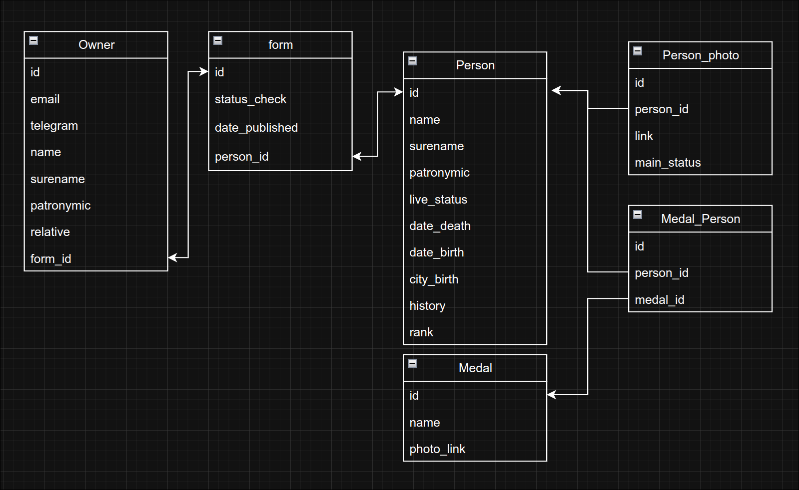

# Запуск приложения
1. Создать .env файл в коре проекта и заполнить
   его полями в соответствии с env.example(читать раздел .env)
2. docker compose up --build

# .env
`Создать в корне файл .env и заполнить в соответствии с configs/env.example`
- SERVER_PORT_HTTP - порт для gRPC-gateway если запускаем не через docker compose
- SERVER_MODE - режим работы сервиса(realise/debug)

- ADMIN_PASSWORD - пароль администратора
- ADMIN_LOGIN - логин администратора

- POSTGRES_DB=postgres - Название базы данных
- POSTGRES_PASSWORD=postgres - Пароль к базе данных
- POSTGRES_USER=postgres - Имя пользователся для базы данных

- POSTGRES_PORT=5432 - Порт работы postgres внешний
- POSTGRES_HOST=localhost - Хост базы данных внешний

- POSTGRES_MIN_CONN=15 - Минимальное количество подключений к базе данных
- POSTGRES_MAX_CONN=50 - Максимально количество подключений к базе данных

- REDIS_PORT=6379 - Порт redis внешний
- REDIS_HOST=localhost - Хост redis внешний

# База данных
## Модель

## Описание
...